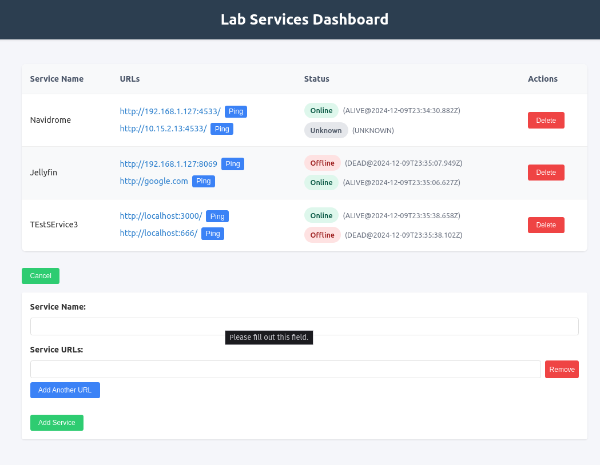

A hacky badly written with llm assist app to keep track of your private lab services



# Development
For dev, simply 'deno run dev'

# Docker Deployment
## Running the application
Simply run:
```bash
docker compose up -d
```
This should build docker image and run it.
Backend and frontend are squished together into same image.

If you want to use pre-built image, from docker hub, see comment inside docker-comose.yaml

## Storage
The services data is persisted in a Docker volume named `services_data`.
